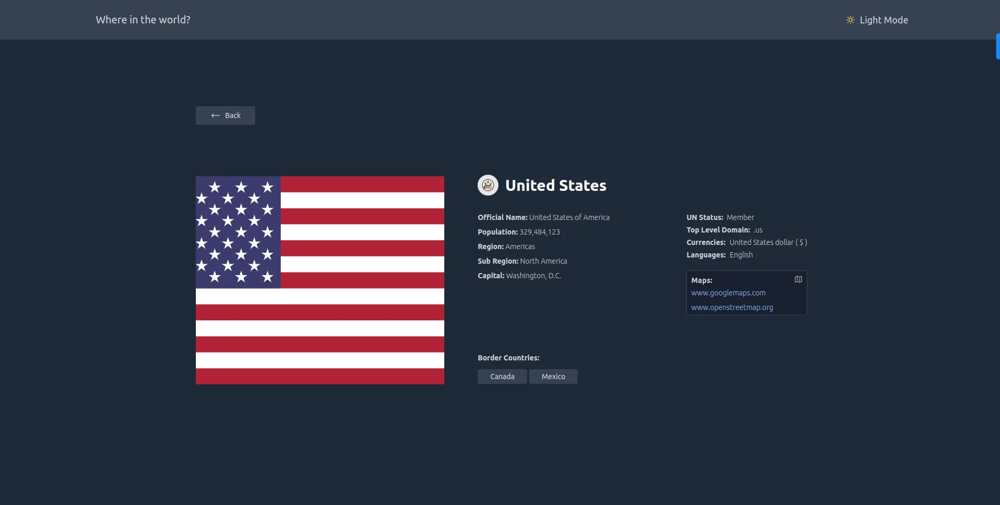
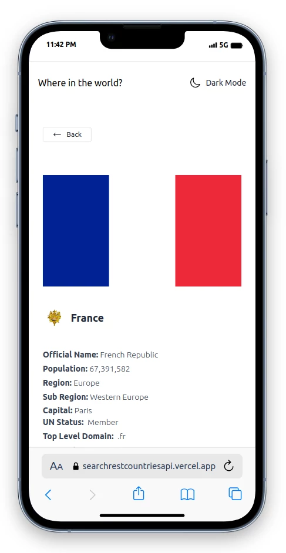

# Frontend Mentor - REST Countries API with color theme switcher solution

This is a solution to the [REST Countries API with color theme switcher challenge on Frontend Mentor](https://www.frontendmentor.io/challenges/rest-countries-api-with-color-theme-switcher-5cacc469fec04111f7b848ca). Frontend Mentor challenges help you improve your coding skills by building realistic projects.

## Table of contents

- [Overview](#overview)
  - [The challenge](#the-challenge)
  - [Screenshot](#screenshot)
  - [Links](#links)
- [My process](#my-process)
  - [Built with](#built-with)
  - [What I learned](#what-i-learned)
  - [Useful resources](#useful-resources)
- [Author](#author)

## Overview

### The challenge

Users should be able to:

- See all countries from the API on the homepage
- Search for a country using an `input` field
- Filter countries by region
- Click on a country to see more detailed information on a separate page
- Click through to the border countries on the detail page
- Toggle the color scheme between light and dark mode _(optional)_

### Screenshot







### Links

- Solution URL: [github/wlowrimore](https://github.com/wlowrimore/frontend-mentor-rest-countries-api)
- Live Site URL: [Search Rest Countries API Challenge](https://searchrestcountriesapi.vercel.app/)

## My process

### Built with

- Semantic HTML5 markup
- Flexbox
- CSS Grid
- Mobile-first workflow
- [Heroicons](https://heroicons.com/)
- [TailwindCSS](https://tailwindcss.com/) - For Styling
- [React](https://reactjs.org/) - JS library
- [Next.js](https://nextjs.org/) - React framework
- [Next-Themes](https://www.npmjs.com/package/next-themes?activeTab=readme) - For Dark/Light Themes

### What I learned

I learned a lot of small things and some big things, but I am sharing the code below because it was my major 'Gotcha!'. React has a built in function called AbortController. The purpose of the controller is to stop your fetch function from calling the API with every keystroke. Unfortunately, Next.js versions later than v12 do not support it (I'm using the latest v14+). This is where the debounce function with the [useCallback](https://react.dev/reference/react/useCallback) Hook comes into play. This function marries Vanilla JS with the primitive useCallback Hook provided by React. It was quite a trial and error process, but it does the trick, and I'm proud of it!.

```JS
// Debounce Fn to Wrap SearchHandler and Act as AbortController.
// This keeps the Fetch Function From Calling API With Every Keystroke.
const debounce = (func, wait) => {
  let timeout;
  return (...args) => {
    clearTimeout(timeout);
    timeout = setTimeout(() => func(...args), wait);
  }
}
// ...code

// Which later in the code is fired here
// Handle Search with Debouncer to Minimize API Requests
  const handleSearch = useCallback(debounce(query => fetchCountryResults(query), 400), [fetchCountryResults])

// Then after the 400ms delay above, the submitHandler takes over with a mostly error free network tab due to the debouncer
// SubmitHandler Grabs CountryCode from SearchedCountry, Updates the URL and Carries the CountryCode Over to the CountryCode Details Page.
  const handleSubmit = (e) => {
    e.preventDefault();
    const countryCode = details?.length > 0 ? details[0]?.cca2 : '';
    console.log('COUNTRY CODE:', countryCode);
    const params = new URLSearchParams(searchParams);
    if (searchedCountry) {
      params.set('query', searchedCountry);
    } else {
      params.delete('query');
    }
    replace(`${pathname}?${params.toString()}`);
    push(`/countries/${countryCode}`);
  };
```

### Useful resources

- [React Key Concepts](https://www.packtpub.com/product/react-key-concepts/9781803234502) - This book is AWESOME!. This book is always within arms reach when I'm coding with the React Library.
- [Google Foo](https://www.google.com) - Knowing how to Google is an art form that I think every developer should get used to. Using Boolean searches, you can always find a way out of a bind!
- [Next.js Documentation](https://nextjs.org/docs) - I am not going to sugar coat it...this documentation isn't the best, but if I look hard enough and long enough I can usually get somewhat of an idea of the solution.

## Author

- Website - [William Lowrimore](https://www.williamlowrimore.com)
- Frontend Mentor - [@wlowrimore](https://www.frontendmentor.io/profile/wlowrimore)
- Linkedin - [@william-lowrimore-dev](https://www.linkedin.com/in/william-lowrimore-dev)
